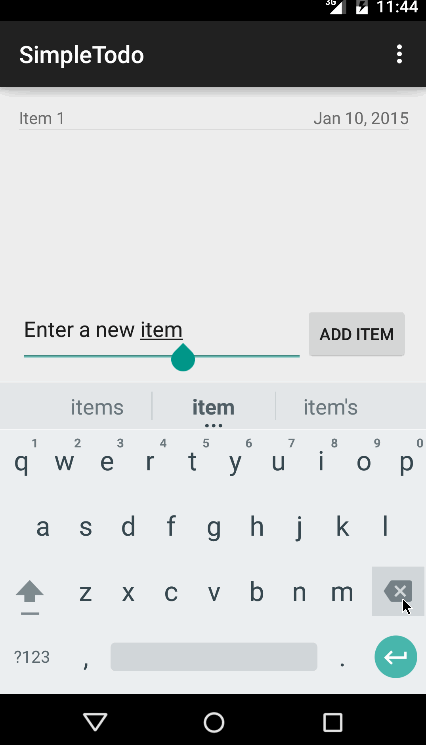

CodePath Android Simple TODO Starter
=====================

This is the Simple TODO starter app for the CodePath Android Course.

Timespent: 3 hours

Completed user stories:

* [x] Required: User can view a list of saved todo items
* [x] Required: User can add items to the todo list
* [x] Required: User can remove items from the todo list
* [x] Required: User can edit items from the todo list

Walkthrough of all user stories:

